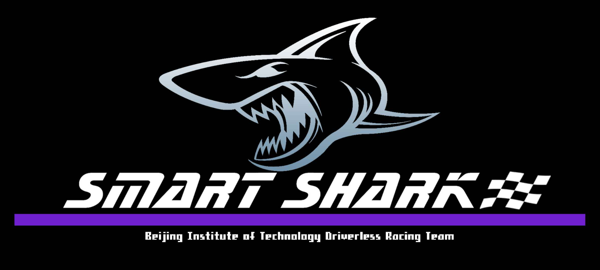

<p align="center"> 

</p>


# fsd_algorithm

This repository is devoted to share the autonomous code of Beijing Institute of Technology Driverless Racing Team. Some simple version code of an autonomous FS race car and some helpful tools are included.

The use of **Ubuntu 18.04 and ROS Melodic** is assumed everywhere on this repository.


# Repository organisation

The repository consists of `ros` and `tools`,` ros` is organised in several top level packages/directories. The top level should adhere to the following subdivision of functionality(a more detailed description can be found in the folders themselves):

**perception/** - folder for perception packages

**estimation/** - folder for estimation packages

**planning/** - folder for planning packages

**control/** - folder for control packagess

**interface_fssim/** - folder for communicating with simulator

# Usage

```bash
# First, clone the repository and move the algorithm package to your workspace
git clone https://github.com/bitfsd/fsd_algorithm.git
cp -r fsd_algorithm/ros "your_workspace_name_1"/src

# Install dependencies
cd ~/"your_workspace_name_1"/src/ros/control/controller/script
sudo apt-get install python-catkin-tools
sudo bash install_cppad.bash
sudo bash install_ipopt.bash

# Compile
cd ~/"your_workspace_name_1"
catkin build

# Second, clone the simulator and move the package to your second workspace
git clone https://github.com/bitfsd/fssim.git
cp -r fssim "your_workspace_name_2"/src

# Install dependencies
cd ~/"your_workspace_name_2"/src/fssim
source update_dependencies.sh
sudo bash Download_model.sh

# Compile
cd ~/"your_workspace_name_2"
catkin build

# Third, run simulation
cd "your_workspace_name_2"
source devel/setup.bash
roslaunch fssim auto_fssim.launch

# and run fssim_interface
cd "your_workspace_name_1"
source devel/setup.bash
roslaunch fssim_interface fssim_interface only_interface.launch

# Finally, run the fsd algorithm
cd "your_workspace_name_1"
source devel/setup.bash
roslaunch fsd_common_meta trackdrive.launch
# roslaunch fsd_common_meta skidpad.launch
# roslaunch fsd_Common_meta acceleration.launch
```


# Open source roadmap

Our goal is to provide a simple implementation of the competition. For ease of use, most ros node use the ros standard message type to send/recieve.  

We will continue to open source our autonomous code, when this part is stable and simple enough.

# Dataset and training

Please visit this page for more details: [bitfsd/FSACOCO](https://github.com/bitfsd/FSACOCO)  

# DarkNet ROS

Please visit this page for more details: [bitfsd/darknet_ros](https://github.com/bitfsd/darknet_ros) 

