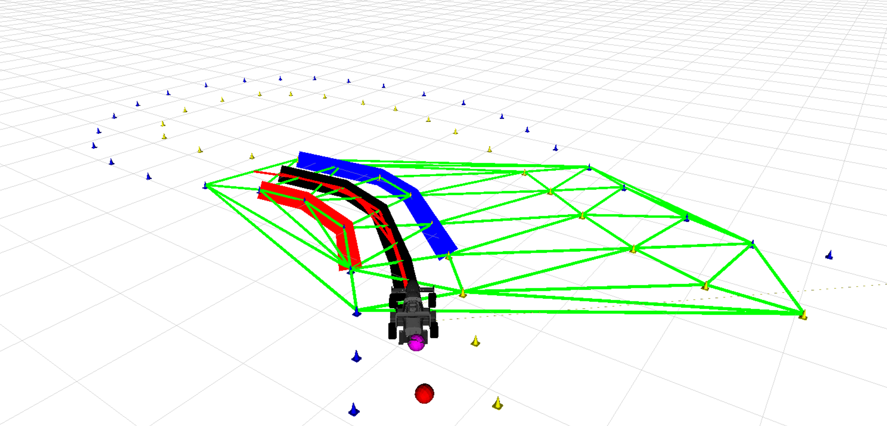

# boundary_detector

This ROS package is an open source version of boundary_detector from BITFSD. We removed some components to keep it simple but it still has great performance.  

 

## Algorithm

The core idea of this algorithm is search and select. The search space is discretized by performing a Delaunay triangulation. A graph searching tree is implemented to get all possible center lines. After that we calculate all trunks' cost, and then select the smallest.  

To balance the performance and computability, a beam search approach will prune the worse branch to keep a fixed number of nodes.  

## Important Dependencies
* ROS
* OpenCV3

---
## ROS topic:
* subscriber:
	- /local_map (fsd_common_msgs/Map)
* publisher:	
	- /planning/boundary_detections (fsd_common_msgs/Map)
	- /visualization/visual_triangles (visualization_msgs::Marker)
	- /visualization/visual_boundary (visualization_msgs::MarkerArray)
	- /visualization/visual_tree (visualization_msgs::MarkerArray)
	- /visualization/visual_path (visualization_msgs::Marker)

---
# Key parameters

All parameters are set in the `./config/boundaryDetector.yaml` 

## Prerequisites

You need to create a local map in the vehicle coordinate system

## Step

* 1. Move package to your workspace.
* 2. Go to your workspace,  `catkin build`
* 3. `source devel/setup.bash`
* 4. `roslaunch boundaryDetector boundaryDetector.launch`
